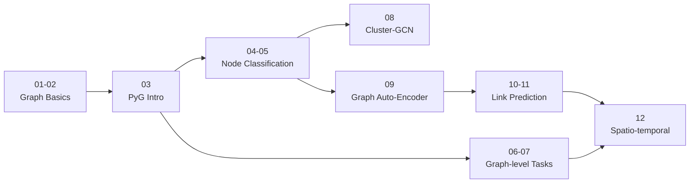

<div align="center">

# 🕸️ Graph Neural Networks (GNNs)

### A hands-on notebook series: from graph basics to spatio-temporal forecasting


</div>

---

## 📖 About

This repository is a step-by-step learning path for **Graph Neural Networks**. It starts with core graph concepts in NetworkX, moves into **PyTorch Geometric (PyG)**, and then works through the main GNN task families:

| Task level | What is predicted |
|---|---|
| 🔵 **Node-level** | A label for each node (e.g. classify papers in a citation network) |
| 🟢 **Graph-level** | A label or value for a whole graph (e.g. molecule properties) |
| 🟣 **Link-level** | Whether or how strongly two nodes connect (e.g. movie recommendations) |
| 🟠 **Spatio-temporal** | Future values on a graph that changes over time (e.g. traffic) |

---

## 🗂️ Notebooks

| # | Notebook | Topic | Level |
|:-:|---|---|:-:|
| 01 | [`01-graph_intro (networkx).ipynb`](./01-graph_intro%20(networkx).ipynb) | Graph fundamentals with NetworkX: nodes, edges, attributes, visualization | 🌱 Beginner |
| 02 | [`02-karate_club_dataset_intro.ipynb`](./02-karate_club_dataset_intro.ipynb) | Exploring the classic Zachary's Karate Club dataset | 🌱 Beginner |
| 03 | [`03-pytorch_geometric_intro.ipynb`](./03-pytorch_geometric_intro.ipynb) | Introduction to PyTorch Geometric: `Data` objects, datasets, mini-batching | 🌱 Beginner |
| 04 | [`04-gcn_karate_club_with_pytorch_geometric.ipynb`](./04-gcn_karate_club_with_pytorch_geometric.ipynb) | Your first Graph Convolutional Network (GCN) on Karate Club | 🌿 Intermediate |
| 05 | [`05-gnn_citations_node_classification_with_pytorch_geometric.ipynb`](./05-gnn_citations_node_classification_with_pytorch_geometric.ipynb) | Node classification on a citation network | 🌿 Intermediate |
| 06 | [`06-Graph_Classification_pyg.ipynb`](./06-Graph_Classification_pyg.ipynb) | Graph classification with pooling / readout layers | 🌿 Intermediate |
| 07 | [`07-Graph_Regression_pyg_ESOL_Dataset.ipynb`](./07-Graph_Regression_pyg_ESOL_Dataset.ipynb) | Graph regression on molecules (ESOL solubility dataset) | 🌿 Intermediate |
| 08 | [`08-cluster_gcn.ipynb`](./08-cluster_gcn.ipynb) | Cluster-GCN: scalable training on large graphs via graph partitioning | 🌳 Advanced |
| 09 | [`09-GAE_Graph_AutoEncoder.ipynb`](./09-GAE_Graph_AutoEncoder.ipynb) | Graph Auto-Encoder (GAE) for unsupervised node embeddings | 🌳 Advanced |
| 10 | [`10_Link_Prediction_(Classification)_on_MovieLens_part1.ipynb`](./10_Link_Prediction_(Classification)_on_MovieLens_part1.ipynb) | Link prediction as classification on MovieLens (Part 1) | 🌳 Advanced |
| 11 | [`11-Link_Regression_on_Movielens_part2.ipynb`](./11-Link_Regression_on_Movielens_part2.ipynb) | Link regression (rating prediction) on MovieLens (Part 2) | 🌳 Advanced |
| 12 | [`12-Spatio_temporal_for_traffic_forecasting.ipynb`](./12-Spatio_temporal_for_traffic_forecasting.ipynb) | Spatio-temporal GNN for traffic forecasting | 🌳 Advanced |
| ➕ | [`gnn_citations.ipynb`](./gnn_citations.ipynb) | Extra: earlier or companion citation-network experiment | 📎 Bonus |

---

## 🧭 Learning Path



---

## 🚀 Getting Started

### 1. Clone the repository

```bash
git clone https://github.com/kasraSMD/GNNs-Graph-Neural-Network.git
cd GNNs-Graph-Neural-Network
```

### 2. Create an environment (recommended)

```bash
python -m venv venv
source venv/bin/activate        # Windows: venv\Scripts\activate
```

### 3. Install dependencies

```bash
pip install torch torch_geometric networkx matplotlib pandas numpy scikit-learn jupyter
```

> 💡 Some notebooks may need extra packages (for example a spatio-temporal library for notebook 12). Check the first code cell of each notebook for install commands. For GPU builds of PyTorch and PyG, follow the official install guides.

### 4. Launch Jupyter

```bash
jupyter notebook
```

> ☁️ **No local setup?** Upload any notebook to [Google Colab](https://colab.research.google.com/) and run it there with a free GPU.

---

## 🧰 Tech Stack

- **[PyTorch](https://pytorch.org/)**: deep learning framework
- **[PyTorch Geometric](https://pytorch-geometric.readthedocs.io/)**: GNN layers, datasets, and utilities
- **[NetworkX](https://networkx.org/)**: graph creation, analysis, and visualization
- **Matplotlib / Pandas / NumPy / scikit-learn**: data handling, plotting, and evaluation

---

## 🎯 What You'll Learn

- ✅ Represent graphs in NetworkX and as PyG `Data` objects
- ✅ Build and train **GCN** models for node classification
- ✅ Perform **graph classification** and **graph regression** on molecular data
- ✅ Scale training to large graphs with **Cluster-GCN**
- ✅ Learn unsupervised embeddings with a **Graph Auto-Encoder**
- ✅ Tackle **link prediction** and **link regression** for recommendation
- ✅ Forecast time-varying signals with **spatio-temporal GNNs**

---

## 🤝 Contributing

Suggestions and improvements are welcome. Feel free to open an issue or submit a pull request.

## 📄 License

This project is licensed under the [MIT License](./LICENSE).

---

<div align="center">

⭐ If you find this repository useful, please consider giving it a star! ⭐

Made with ❤️ by [kasraSMD](https://github.com/kasraSMD)

</div>
